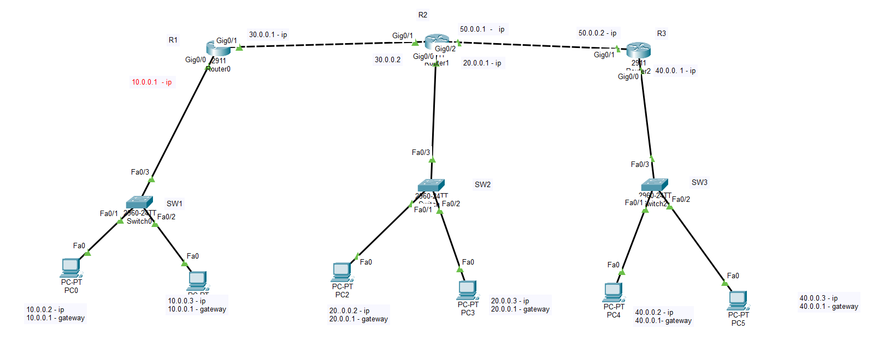
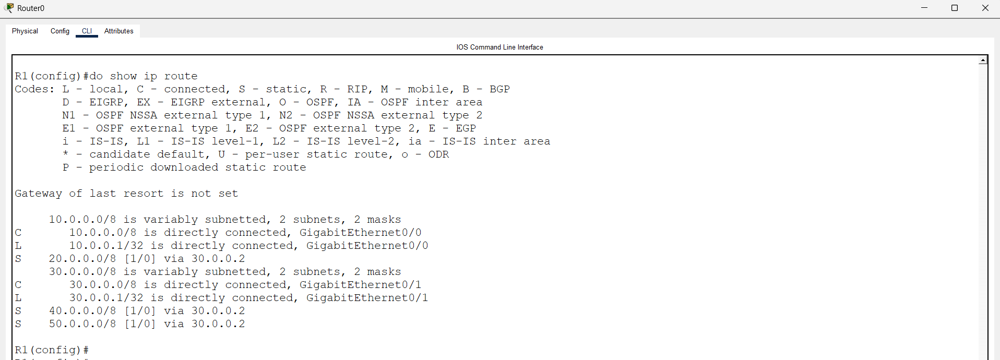
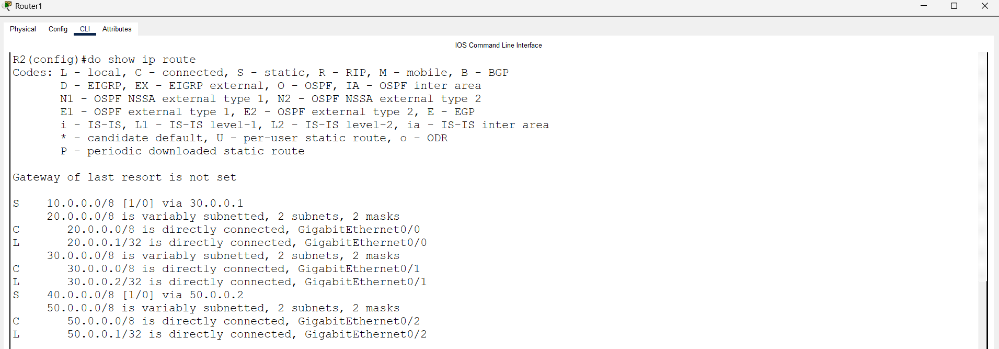
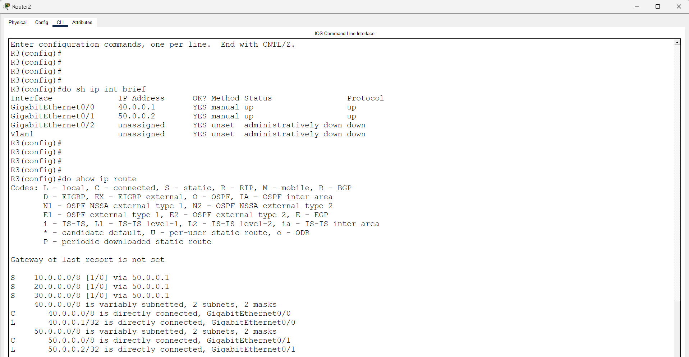
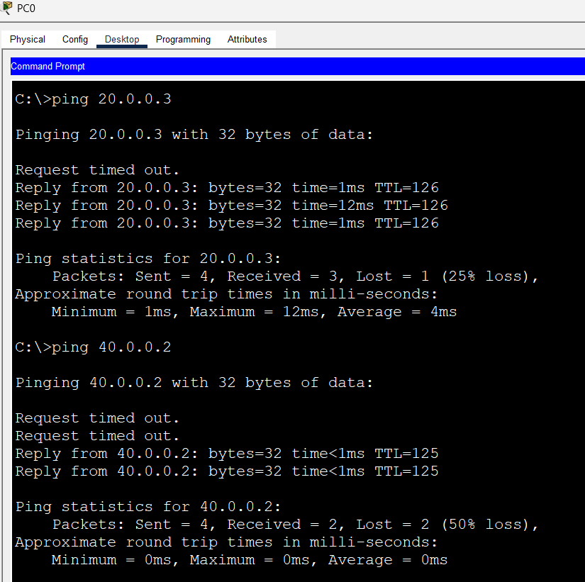
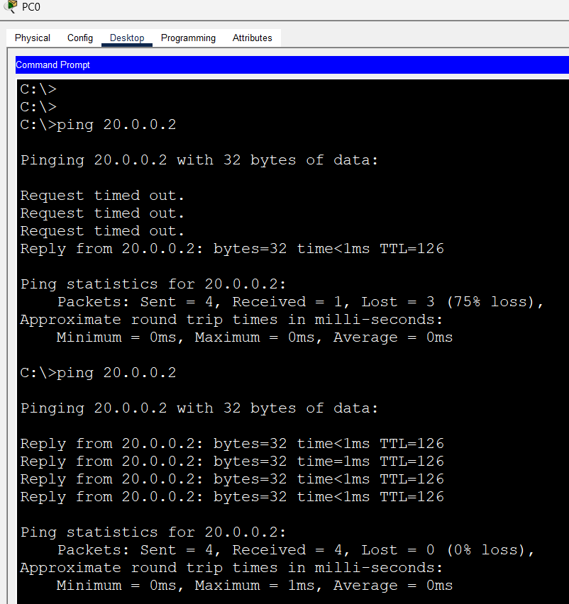
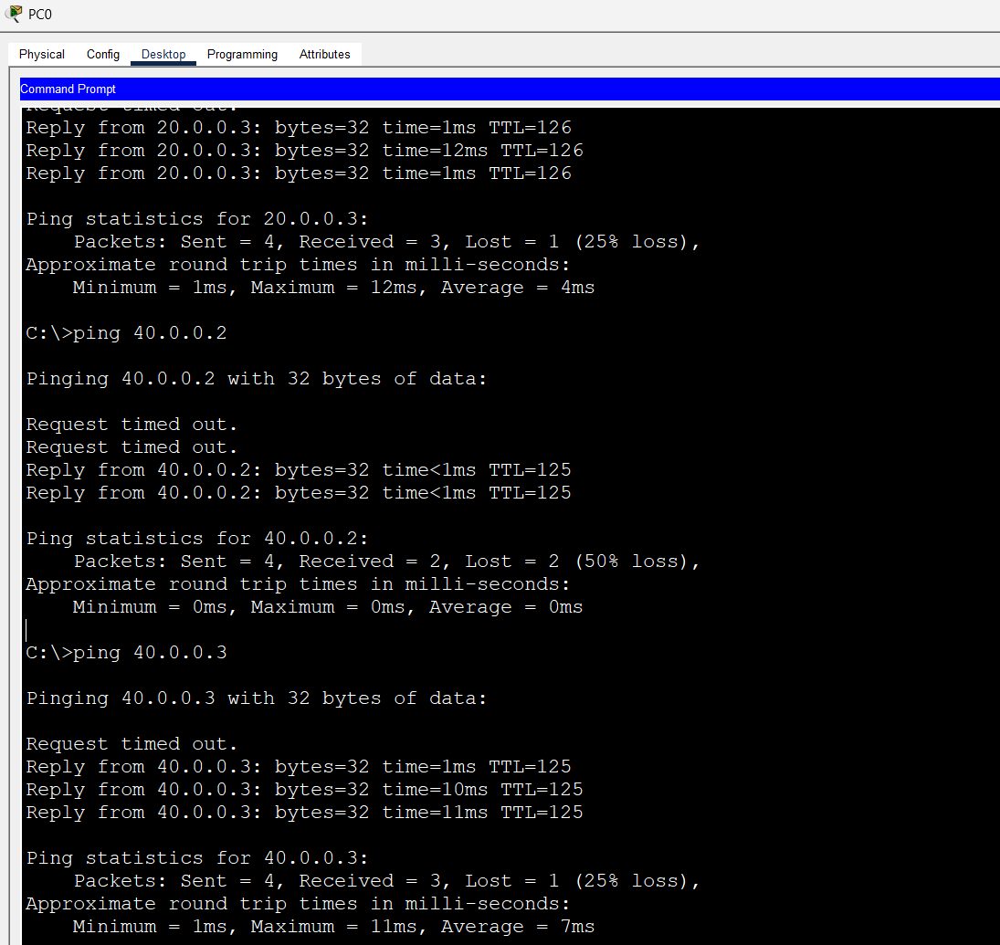

# Static Routing Lab with 3 Routers (Cisco Packet Tracer)

A three-router lab where three separate LANs are connected through R1, R2 and R3. All routing between the networks is done with **static routes**, and end-to-end connectivity is proved with ping tests between PCs on different LANs.

## Objective

- Connect three LANs (10.0.0.0, 20.0.0.0, 40.0.0.0) through three routers
- Configure static routes so every LAN can reach every other LAN
- Verify the routing table on each router
- Test end-to-end connectivity with ping:
  - **PC0 to PC4** (crosses R1, R2 and R3)
  - **PC0 to PC2** (crosses R1 and R2)
  - **PC0 to PC5** (crosses R1, R2 and R3)

## Topology



R1 and R2 are linked on 30.0.0.0. R2 and R3 are linked on 50.0.0.0.

## Devices

| Device | Model |
|---|---|
| R1, R2, R3 | Cisco 2911 router |
| SW1, SW2, SW3 | Cisco 2960-24TT switch |
| PC0 to PC5 | PC-PT |

## IP Addressing

> Subnet mask used in this lab: **255.0.0.0 (/8)**.

### Router interfaces

| Router | Interface | IP Address | Connected to |
|---|---|---|---|
| R1 | Gig0/0 | 10.0.0.1 | SW1 (Fa0/3) |
| R1 | Gig0/1 | 30.0.0.1 | R2 |
| R2 | Gig0/0 | 20.0.0.1 | SW2 (Fa0/3) |
| R2 | Gig0/1 | 30.0.0.2 | R1 |
| R2 | Gig0/2 | 50.0.0.1 | R3 |
| R3 | Gig0/0 | 40.0.0.1 | SW3 (Fa0/3) |
| R3 | Gig0/1 | 50.0.0.2 | R2 |

### End devices

| PC | IP Address | Subnet Mask | Default Gateway | Switch Port |
|---|---|---|---|---|
| PC0 | 10.0.0.2 | 255.0.0.0 | 10.0.0.1 | SW1 Fa0/1 |
| PC1 | 10.0.0.3 | 255.0.0.0 | 10.0.0.1 | SW1 Fa0/2 |
| PC2 | 20.0.0.2 | 255.0.0.0 | 20.0.0.1 | SW2 Fa0/1 |
| PC3 | 20.0.0.3 | 255.0.0.0 | 20.0.0.1 | SW2 Fa0/2 |
| PC4 | 40.0.0.2 | 255.0.0.0 | 40.0.0.1 | SW3 Fa0/1 |
| PC5 | 40.0.0.3 | 255.0.0.0 | 40.0.0.1 | SW3 Fa0/2 |

The switches (SW1, SW2, SW3) work with their default configuration. No VLANs or IP addresses are needed on them.

## How Static Routing Works Here

Each router already knows the networks that are **directly connected** to it. For every other network, it needs a static route that tells it which neighbour (next hop) to send the packets to.

| Router | Directly connected | Static routes needed | Next hop |
|---|---|---|---|
| R1 | 10.0.0.0, 30.0.0.0 | 20.0.0.0, 40.0.0.0, 50.0.0.0 | 30.0.0.2 (R2) |
| R2 | 20.0.0.0, 30.0.0.0, 50.0.0.0 | 10.0.0.0 | 30.0.0.1 (R1) |
| R2 | | 40.0.0.0 | 50.0.0.2 (R3) |
| R3 | 40.0.0.0, 50.0.0.0 | 10.0.0.0, 20.0.0.0, 30.0.0.0 | 50.0.0.1 (R2) |

Every router needs a route back to the source network too, otherwise the ping request reaches the destination but the reply never returns.

## Configuration

Syntax: `ip route <destination network> <subnet mask> <next-hop IP>`

### R1

```
R1> enable
R1# configure terminal
R1(config)# interface gigabitEthernet 0/0
R1(config-if)# ip address 10.0.0.1 255.0.0.0
R1(config-if)# no shutdown
R1(config-if)# exit
R1(config)# interface gigabitEthernet 0/1
R1(config-if)# ip address 30.0.0.1 255.0.0.0
R1(config-if)# no shutdown
R1(config-if)# exit
R1(config)# ip route 20.0.0.0 255.0.0.0 30.0.0.2
R1(config)# ip route 40.0.0.0 255.0.0.0 30.0.0.2
R1(config)# ip route 50.0.0.0 255.0.0.0 30.0.0.2
R1(config)# end
R1# copy running-config startup-config
```

### R2

```
R2> enable
R2# configure terminal
R2(config)# interface gigabitEthernet 0/0
R2(config-if)# ip address 20.0.0.1 255.0.0.0
R2(config-if)# no shutdown
R2(config-if)# exit
R2(config)# interface gigabitEthernet 0/1
R2(config-if)# ip address 30.0.0.2 255.0.0.0
R2(config-if)# no shutdown
R2(config-if)# exit
R2(config)# interface gigabitEthernet 0/2
R2(config-if)# ip address 50.0.0.1 255.0.0.0
R2(config-if)# no shutdown
R2(config-if)# exit
R2(config)# ip route 10.0.0.0 255.0.0.0 30.0.0.1
R2(config)# ip route 40.0.0.0 255.0.0.0 50.0.0.2
R2(config)# end
R2# copy running-config startup-config
```

### R3

```
R3> enable
R3# configure terminal
R3(config)# interface gigabitEthernet 0/0
R3(config-if)# ip address 40.0.0.1 255.0.0.0
R3(config-if)# no shutdown
R3(config-if)# exit
R3(config)# interface gigabitEthernet 0/1
R3(config-if)# ip address 50.0.0.2 255.0.0.0
R3(config-if)# no shutdown
R3(config-if)# exit
R3(config)# ip route 10.0.0.0 255.0.0.0 50.0.0.1
R3(config)# ip route 20.0.0.0 255.0.0.0 50.0.0.1
R3(config)# ip route 30.0.0.0 255.0.0.0 50.0.0.1
R3(config)# end
R3# copy running-config startup-config
```

Ready-to-paste config files: [R1.txt](configs/R1.txt), [R2.txt](configs/R2.txt), [R3.txt](configs/R3.txt).

## Verification

Run these on each router:

```
show ip interface brief
show ip route
show running-config | include ip route
```



In `show ip route`, directly connected networks appear with the code **C** (and **L** for the router's own interface address) and static routes with the code **S**.

R1 routing table:

- **C** 10.0.0.0/8 via GigabitEthernet0/0 and **C** 30.0.0.0/8 via GigabitEthernet0/1 (directly connected)
- **S** 20.0.0.0/8 [1/0] via 30.0.0.2
- **S** 40.0.0.0/8 [1/0] via 30.0.0.2
- **S** 50.0.0.0/8 [1/0] via 30.0.0.2

`[1/0]` means administrative distance 1 and metric 0, which is the default for a static route.

R2 routing table:



- **C** 20.0.0.0/8 (Gig0/0), 30.0.0.0/8 (Gig0/1) and 50.0.0.0/8 (Gig0/2) are directly connected
- **S** 10.0.0.0/8 [1/0] via 30.0.0.1 (R1)
- **S** 40.0.0.0/8 [1/0] via 50.0.0.2 (R3)

R3 interface status and routing table:



- `show ip interface brief` shows Gig0/0 (40.0.0.1) and Gig0/1 (50.0.0.2) both **up/up**
- **C** 40.0.0.0/8 (Gig0/0) and 50.0.0.0/8 (Gig0/1) are directly connected
- **S** 10.0.0.0/8, 20.0.0.0/8 and 30.0.0.0/8 [1/0] via 50.0.0.1 (R2)


## Connectivity Tests

### Test 1: PC0 to PC4

PC0 (10.0.0.2) in the first LAN pings PC4 (40.0.0.2) in the third LAN.

Path: `PC0 -> SW1 -> R1 -> R2 -> R3 -> SW3 -> PC4`

```
C:\> ping 40.0.0.2
```



Result:

- **PC0 to PC4 (40.0.0.2):** 2 requests timed out (ARP delay), then 2 replies came back (2/4 received).
- **TTL = 125:** the packet started with TTL 128 and passed through 3 routers (R1, R2 and R3), so each router reduced it by 1.
- The same screenshot also shows PC0 pinging PC3 (20.0.0.3): 3/4 replies with TTL = 126 (2 routers, R1 and R2).

Trace the path hop by hop:

```
C:\> tracert 40.0.0.2
```

The path should show 10.0.0.1 (R1), 30.0.0.2 (R2), 50.0.0.2 (R3) and then 40.0.0.2 (PC4).

### Test 2: PC0 to PC2

PC0 (10.0.0.2) in the first LAN pings PC2 (20.0.0.2) in the second LAN.

Path: `PC0 -> SW1 -> R1 -> R2 -> SW2 -> PC2`

```
C:\> ping 20.0.0.2
```



Result:

- **First attempt:** 3 requests timed out and 1 reply came back (1/4 received). This is the normal ARP delay while the devices learn each other's MAC addresses.
- **Second attempt:** 4/4 replies received, 0% loss.
- **TTL = 126:** the packet started with TTL 128 and passed through 2 routers (R1 and R2), so each router reduced it by 1.

### Test 3: PC0 to PC5

PC0 (10.0.0.2) in the first LAN pings PC5 (40.0.0.3) in the third LAN.

Path: `PC0 -> SW1 -> R1 -> R2 -> R3 -> SW3 -> PC5`

```
C:\> ping 40.0.0.3
```



Result: 1 request timed out (ARP delay) and 3 replies came back (3/4 received). **TTL = 125** again confirms the packet crossed 3 routers (R1, R2 and R3).

### Test Summary

| Test | Source | Destination | Routers crossed | Result | TTL |
|---|---|---|---|---|---|
| 1 | PC0 (10.0.0.2) | PC4 (40.0.0.2) | R1, R2, R3 | 2/4 replies | 125 |
| 2 | PC0 (10.0.0.2) | PC2 (20.0.0.2) | R1, R2 | 4/4 replies on 2nd attempt | 126 |
| 3 | PC0 (10.0.0.2) | PC5 (40.0.0.3) | R1, R2, R3 | 3/4 replies | 125 |
| Extra | PC0 (10.0.0.2) | PC3 (20.0.0.3) | R1, R2 | 3/4 replies | 126 |

> Note: In Packet Tracer the first ping packets can time out because the devices are still doing ARP and building their MAC tables. The remaining packets reply normally. A TTL of 126 (2 routers) or 125 (3 routers) proves the packets were routed hop by hop through the static routes.

## Troubleshooting

| Problem | What to check |
|---|---|
| Ping to another LAN fails | PC default gateway is correct and the router interface is `up/up` (`show ip interface brief`) |
| Ping reaches only the first router | A static route is missing or the next-hop IP is wrong (`show ip route`) |
| Ping works one way only | The return route is missing on a router in the path |
| Router interface shows `administratively down` | Missing `no shutdown` |
| Route is not in the table | The next hop is not reachable, or the interface to it is down |
| First ping times out, rest succeed | Normal ARP delay, not an error |

## Conclusion

All three LANs can reach each other. The routing tables on R1, R2 and R3 contain the expected connected (C) and static (S) routes, and the ping tests across 2 and 3 routers succeed, so the static routing configuration works end to end.

## What I Learned

- How routers forward traffic between different networks using a routing table
- How to configure static routes with the `ip route` command and choose the correct next hop
- Why every router in the path needs a route back to the source network
- How to read `show ip route` and identify connected (C) and static (S) routes
- How to test and troubleshoot connectivity using ping and tracert

## Files

```
.
├── README.md
├── Static-Routing-Lab.pkt
├── configs/
│   ├── R1.txt
│   ├── R2.txt
│   └── R3.txt
└── images/
    ├── topology.png
    ├── r1-ip-route.png
    ├── r2-ip-route.png
    ├── r3-ip-route.png
    ├── ping-pc0-to-pc4.png
    ├── ping-pc0-to-pc2.png
    └── ping-pc0-to-pc5.png
```

## Tools

- Cisco Packet Tracer
- Opening the `.pkt` file requires Cisco Packet Tracer
